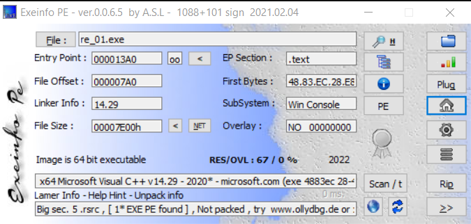
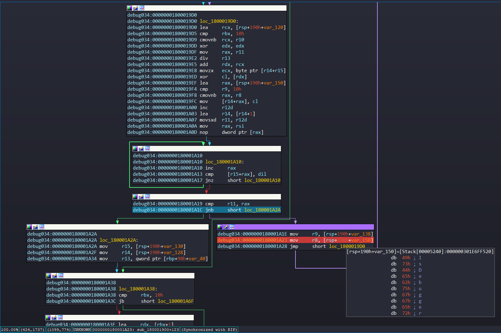
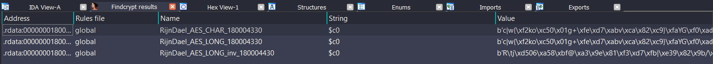
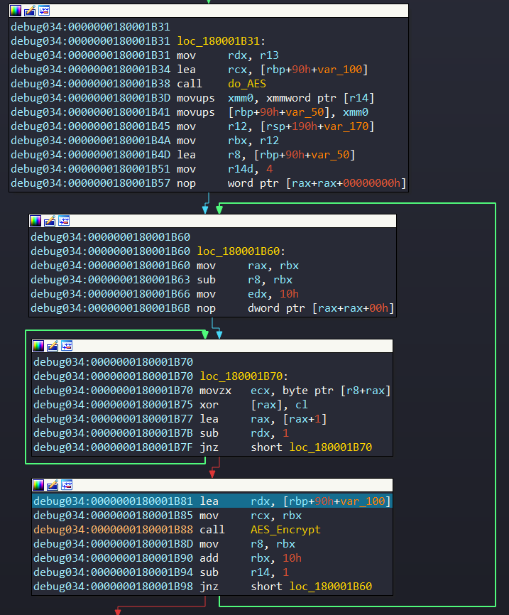

# RE01

## Description
- Good luck. Flag format: FPTUHacking{text_you_found}

## General Information
- Sử dụng ExeinfoPE, mình thu được thông tin như sau:
- Compiler: MSVC++
- 64 bit



## Analysis
- Hàm main:

```c++
int __cdecl main(int argc, const char **argv, const char **envp)
{
  HRSRC v3; // rbx
  DWORD v4; // edi
  HGLOBAL v5; // rsi
  void *v6; // rbx

  sub_140001010("----------------=================[ RE01 ]=================----------------\n");
  sub_140001010("|[INFO] Good luck and have fun ;)                                        |\n");
  sub_140001010("----------------=================[ RE01 ]=================----------------\n");
  v3 = FindResourceW(0i64, (LPCWSTR)0x6B, L"Hackforces_2022");
  v4 = SizeofResource(0i64, v3);
  v5 = LoadResource(0i64, v3);
  v6 = VirtualAlloc(0i64, v4, 0x1000u, 0x40u);
  memcpy(v6, v5, v4);
  ((void (*)(void))v6)();
  return 0;
}
```

- Chương trình sử dụng API `LoadResource` để load shellcode có tên `Hackforces_2022`, sau đó thực thi shellcode ở cuối dòng hàm main.
* Chiến thuật: Debug thẳng vào đoạn code thực thi shellcode đó, vì resourse sau khi dump ra bằng công cụ `Resource Hacker`, dữ kiện duy nhất mà mình có thể biết được đó là shellcode được tạo bởi 1 file PE (không rõ là DLL file hoặc EXE file). Khi debug, mình sẽ gặp rất nhiều các đoạn code đã bị stripped, nhưng thực chất đó chỉ là các file thư viện được import từ project thôi và Debug tới khi mà thấy được hàm có đuôi cuối là: `D10` thì ấn F7 vào hàm nó.
- Hình dưới là đoạn `call   near ptr unk_180001D10`, đối với máy khác có thể là khác base address.

```c++
debug034:0000000180001F80 ; ---------------------------------------------------------------------------
debug034:0000000180001F80
debug034:0000000180001F80 loc_180001F80:                          ; CODE XREF: debug034:0000000180002486↓p
debug034:0000000180001F80                                         ; debug034:00000001800024A2↓p
debug034:0000000180001F80 sub     rsp, 28h
debug034:0000000180001F84 cmp     edx, 1
debug034:0000000180001F87 jz      short loc_180001F93
debug034:0000000180001F89 mov     eax, 1
debug034:0000000180001F8E add     rsp, 28h
debug034:0000000180001F92 retn
debug034:0000000180001F93 ; ---------------------------------------------------------------------------
debug034:0000000180001F93
debug034:0000000180001F93 loc_180001F93:                          ; CODE XREF: debug034:0000000180001F87↑j
debug034:0000000180001F93 call    near ptr unk_180001D10  // Hàm Main của PE file
```

## Phân tích hàm main trong shellcode

Hàm main:

```asm
void __noreturn sub_180001D10()
{
  __int64 v0; // rax
  int (__fastcall *v1)(__int64, __int64, __int64 *); // rbx
  __int64 v2; // rax
  __m128i v3; // xmm0
  int v4[4]; // [rsp+30h] [rbp-D0h] BYREF
  __m128i v5; // [rsp+40h] [rbp-C0h] BYREF
  __int64 v6; // [rsp+50h] [rbp-B0h] BYREF
  __m128i v7; // [rsp+60h] [rbp-A0h]
  int v8[4]; // [rsp+70h] [rbp-90h] BYREF
  int v9[16]; // [rsp+80h] [rbp-80h] BYREF
  int v10[16]; // [rsp+C0h] [rbp-40h] BYREF
  char v11[256]; // [rsp+100h] [rbp+0h] BYREF

  v0 = ((__int64 (__fastcall *)(const char *))kernel32_LoadLibraryA)("ntdll.dll");
  if ( v0 )
  {
    v1 = (int (__fastcall *)(__int64, __int64, __int64 *))((__int64 (__fastcall *)(__int64, const char *))kernel32_GetProcAddress)(
                                                            v0,
                                                            "NtQueryInformationProcess");
    if ( v1 )
    {
      v6 = 0i64;
      v2 = ((__int64 (*)(void))kernel32_GetCurrentProcess)();
      if ( v1(v2, 30i64, &v6) >= 0 )
      {
        if ( v6 )
        {
          ((void (__fastcall *)(__int64))kernel32_ExitProcess)(0xFFFFFFFFi64);
          __debugbreak();
        }
      }
    }
  }
  v8[0] = -1571306580;
  v8[1] = -1103617446;
  v8[2] = 657989236;
  v8[3] = -1565222734;
  v4[0] = 50462976;
  v4[1] = 117835012;
  v4[2] = 185207048;
  v4[3] = 252579084;
  v10[0] = -1270557420;
  v10[1] = 631056920;
  v10[2] = -821605056;
  v10[3] = 1496124470;
  v10[4] = 1620450063;
  v10[5] = 649009965;
  v10[6] = 1665333180;
  v10[7] = 1044540027;
  v10[8] = -43994052;
  v10[9] = 173816066;
  v10[10] = -1952071548;
  v10[11] = -1447072236;
  v10[12] = 1574880158;
  v10[13] = -1305203366;
  v10[14] = 2011033649;
  v10[15] = -631658710;
  v9[0] = 1806472503;
  v9[1] = 1085489442;
  v9[2] = -1470475092;
  v9[3] = 1026315931;
  v9[4] = -2006079884;
  v9[5] = 861288538;
  v9[6] = -1235265430;
  v9[7] = -983333111;
  v9[8] = 2047037488;
  v9[9] = -1531926342;
  v9[10] = 63277076;
  v9[11] = -1936053657;
  v9[12] = 77833316;
  v9[13] = -2127711410;
  v9[14] = 1601204360;
  v9[15] = 646985157;
  ((void (__fastcall *)(char *, _QWORD, __int64))unk_180002EF8)(v11, 0i64, 256i64);
  v5.m128i_i64[0] = 0x75E9127C9F5BEE05i64;
  v5.m128i_i64[1] = 0xC689ACC3A8D17E54ui64;
  v7.m128i_i64[0] = 0x75E93246D81AA243i64;
  v6 = 0xC689ACC3A8D17E54ui64;
  v3 = _mm_load_si128(&v5);
  v7.m128i_i64[1] = 0xC689ACC3A8D17E54ui64;
  v5 = _mm_xor_si128(v3, v7);
  ((void (__fastcall *)(__m128i *))unk_180001690)(&v5);
  ((void (*)(const char *, ...))unk_1800016F0)("%64s", v11);
  ((void (__fastcall *)(char *, int *, int *, int *, int *))unk_180001900)(v11, v10, v8, v4, v9);
  JUMPOUT(0x180001F7Ci64);
}
```

Đoạn code ở những dòng đầu tiên, mình đã sử dụng kỹ thuật Anti-Debug bằng cách sử dụng API `NtQueryInformationProcess` và hàm `GetCurrentProcess` nhằm gọi hàm `ExitProcess` mỗi khi chương trình bật chế độ debug. đoạn If dưới nó luôn luôn nhảy với hàm `ExitProcess`:

```c++
    v1 = (int (__fastcall *)(__int64, __int64, __int64 *))((__int64 (__fastcall *)(__int64, const char *))kernel32_GetProcAddress)(
                                                            v0,
                                                            "NtQueryInformationProcess");
    if ( v1 )
    {
      v6 = 0i64;
      v2 = ((__int64 (*)(void))kernel32_GetCurrentProcess)();
      if ( v1(v2, 30i64, &v6) >= 0 )
      {
        if ( v6 )
        {
          ((void (__fastcall *)(__int64))kernel32_ExitProcess)(0xFFFFFFFFi64);
          __debugbreak();
        }
      }
```

* Chiến thuật: Trước khi chương trình trace tới `cmp     [rsp+210h+var_1C0], 0`, patch lệnh `jz` sang lệnh `jnz` sau đó tiếp tục trace. Lưu ý trước khi patch, các bạn cần phải chọn chế độ `Reanalyze Program` để IDA hiểu các instructions đó là 1 hàm.

Ở các dòng code tiếp theo, mình đã sử dụng obfuscation nhằm mã hoá các strings khiến cho việc dịch ngược trở nên khó khăn hơn. Mình sẽ ghi chú các đoạn strings giải mã ở từng dòng.

```asm
debug035:0000000180001DA5 loc_180001DA5:                          ; CODE XREF: sub_180001D10+36↑j
debug035:0000000180001DA5                                         ; sub_180001D10+4E↑j ...
debug035:0000000180001DA5 xor     edx, edx
debug035:0000000180001DA7 mov     [rsp+210h+var_1A0], 0A257C3ACh        //
debug035:0000000180001DAF mov     r8d, 100h
debug035:0000000180001DB5 mov     [rsp+210h+var_19C], 0BE38225Ah        //
debug035:0000000180001DBD lea     rcx, [rbp+110h+var_110]
debug035:0000000180001DC1 mov     [rsp+210h+var_198], 27381E74h         //
debug035:0000000180001DC9 mov     [rsp+210h+var_194], 0A2B498B2h        // 16 bytes đầu là AESkey
debug035:0000000180001DD1 mov     [rsp+210h+var_1E0], 3020100h          //
debug035:0000000180001DD9 mov     [rsp+210h+var_1DC], 7060504h          //
debug035:0000000180001DE1 mov     [rsp+210h+var_1D8], 0B0A0908h         //
debug035:0000000180001DE9 mov     [rsp+210h+var_1D4], 0F0E0D0Ch         // 16 bytes kế tiếp là AESiv
debug035:0000000180001DF1 mov     [rbp+110h+var_150], 0B444D514h        //
debug035:0000000180001DF8 mov     [rbp+110h+var_14C], 259D2A18h         //  
debug035:0000000180001DFF mov     [rbp+110h+var_148], 0CF074D40h        //
debug035:0000000180001E06 mov     [rbp+110h+var_144], 592D0C36h         //
debug035:0000000180001E0D mov     [rbp+110h+var_140], 60961B0Fh         //
debug035:0000000180001E14 mov     [rbp+110h+var_13C], 26AF1B2Dh         //
debug035:0000000180001E1B mov     [rbp+110h+var_138], 6342F7BCh         //
debug035:0000000180001E22 mov     [rbp+110h+var_134], 3E426A7Bh         //
debug035:0000000180001E29 mov     [rbp+110h+var_130], 0FD60B43Ch        //
debug035:0000000180001E30 mov     [rbp+110h+var_12C], 0A5C3902h         //  
debug035:0000000180001E37 mov     [rbp+110h+var_128], 8BA5C084h         //
debug035:0000000180001E3E mov     [rbp+110h+var_124], 0A9BF6E14h        //
debug035:0000000180001E45 mov     [rbp+110h+var_120], 5DDEC39Eh         //
debug035:0000000180001E4C mov     [rbp+110h+var_11C], 0B2342D5Ah        //
debug035:0000000180001E53 mov     [rbp+110h+var_118], 77DDF031h         //
debug035:0000000180001E5A mov     [rbp+110h+var_114], 0DA59A72Ah        // 64 bytes kế tiếp là AES Cipher
debug035:0000000180001E61 mov     [rbp+110h+var_190], 6BAC9537h         //
debug035:0000000180001E68 mov     [rbp+110h+var_18C], 40B34122h         //
debug035:0000000180001E6F mov     [rbp+110h+var_188], 0A85A54ACh        //
debug035:0000000180001E76 mov     [rbp+110h+var_184], 3D2C569Bh         //
debug035:0000000180001E7D mov     [rbp+110h+var_180], 886DA674h         //
debug035:0000000180001E84 mov     [rbp+110h+var_17C], 3356385Ah         //
debug035:0000000180001E8B mov     [rbp+110h+var_178], 0B65F586Ah        //
debug035:0000000180001E92 mov     [rbp+110h+var_174], 0C5638709h        //
debug035:0000000180001E99 mov     [rbp+110h+var_170], 7A035030h         //
debug035:0000000180001EA0 mov     [rbp+110h+var_16C], 0A4B0A8BAh        //
debug035:0000000180001EA7 mov     [rbp+110h+var_168], 3C58814h          //
debug035:0000000180001EAE mov     [rbp+110h+var_164], 8C9A2A67h         //
debug035:0000000180001EB5 mov     [rbp+110h+var_160], 4A3A464h          //
debug035:0000000180001EBC mov     [rbp+110h+var_15C], 812DB34Eh         //
debug035:0000000180001EC3 mov     [rbp+110h+var_158], 5F707088h         //
debug035:0000000180001ECA mov     [rbp+110h+var_154], 269035C5h         // 64 bytes cuối là keyxor của cipher
debug035:0000000180001ED1 call    sub_180002EF8
debug035:0000000180001ED6 mov     rcx, 0C689ACC3A8D17E54h               // Từ địa chỉ `0x180001ED6` tới `0x180001F3B`, thực hiện lệnh XOR nhằm giải mã chuỗi `FLAG: `
debug035:0000000180001EE0 mov     rax, 75E9127C9F5BEE05h                // cipher = bytes.fromhex("0x00C689ACC3A8D17E5475E9127C9F5BEE05"[2:])[::-1]
debug035:0000000180001EEA mov     [rsp+210h+var_1C0], rax               // key = bytes.fromhex("0x75E93246D81AA243"[2:])[::-1]
debug035:0000000180001EEF mov     rax, [rsp+210h+var_1C0]               // out = []
debug035:0000000180001EF4 mov     qword ptr [rsp+210h+var_1D0], rax     // for i in range(len(cipher)):
debug035:0000000180001EF9 mov     [rsp+210h+var_1C0], rcx               //     out.append(chr(cipher[i] ^ key[i % len(key)]))
debug035:0000000180001EFE mov     rax, [rsp+210h+var_1C0]               // print(out)
debug035:0000000180001F03 mov     qword ptr [rsp+210h+var_1D0+8], rax
debug035:0000000180001F08 mov     rax, 75E93246D81AA243h                // Key xor: 0x75E93246D81AA243
debug035:0000000180001F12 mov     [rsp+210h+var_1C0], rax
debug035:0000000180001F17 mov     rax, [rsp+210h+var_1C0]
debug035:0000000180001F1C mov     qword ptr [rsp+210h+var_1B0], rax
debug035:0000000180001F21 mov     [rsp+210h+var_1C0], rcx
debug035:0000000180001F26 lea     rcx, [rsp+210h+var_1D0]
debug035:0000000180001F2B mov     rax, [rsp+210h+var_1C0]
debug035:0000000180001F30 movdqa  xmm0, [rsp+210h+var_1D0]
debug035:0000000180001F36 mov     qword ptr [rsp+210h+var_1B0+8], rax
debug035:0000000180001F3B pxor    xmm0, [rsp+210h+var_1B0]              // XOR cipher với key: cipher[i] ^ key[i % len(key)]
debug035:0000000180001F41 movdqa  [rsp+210h+var_1D0], xmm0
debug035:0000000180001F47 call    sub_180001690                         // Print ra console: `FLAG: `
debug035:0000000180001F4C lea     rdx, [rbp+110h+var_110]
debug035:0000000180001F50 lea     rcx, a64s                       ; "%64s"
debug035:0000000180001F57 call    sub_1800016F0                         // Nhận 64 bytes đầu vào.
debug035:0000000180001F5C lea     rax, [rbp+110h+var_190]
debug035:0000000180001F60 lea     r9, [rsp+210h+var_1E0]
debug035:0000000180001F65 mov     [rsp+210h+var_1F0], rax
debug035:0000000180001F6A lea     r8, [rsp+210h+var_1A0]
debug035:0000000180001F6F lea     rdx, [rbp+110h+var_150]
debug035:0000000180001F73 lea     rcx, [rbp+110h+var_110]
debug035:0000000180001F77 call    sub_180001900
debug035:0000000180001F77 sub_180001D10 endp
```

Debug tới hàm `sub_180001900`:



Đặt breakpoint như hình, sẽ thu được 1 chuỗi `IsDebuggerPresent`. Tiếp tục trace tiếp tới đoạn dưới: 

```asm
debug034:0000000180001A6F
debug034:0000000180001A6F loc_180001A6F:
debug034:0000000180001A6F mov     [rbp+90h+var_110], rdi
debug034:0000000180001A73 mov     [rbp+90h+var_108], 0Fh
debug034:0000000180001A7B mov     byte ptr [rsp+190h+var_120], dil
debug034:0000000180001A80 lea     rax, [rsp+190h+var_150]
debug034:0000000180001A85 mov     qword ptr [rsp+190h+var_160], rax
debug034:0000000180001A8A lea     rcx, aKernel32Dll_0 ; "kernel32.dll"
debug034:0000000180001A91 call    cs:off_180004008
debug034:0000000180001A97 test    rax, rax
debug034:0000000180001A9A jnz     short loc_180001AA5
```

```asm
debug035:0000000180004008 off_180004008 dq offset kernel32_GetModuleHandleA
debug035:0000000180004008                                         ; DATA XREF: sub_180001900+191↑r
debug035:0000000180004010 off_180004010 dq offset kernel32_LoadLibraryA
debug035:0000000180004010                                         ; DATA XREF: sub_180001D10+2D↑r
debug035:0000000180004018 off_180004018 dq offset kernel32_GetProcAddress
debug035:0000000180004018                                         ; DATA XREF: sub_180001900+1B9↑r
debug035:0000000180004018                                         ; sub_180001D10+42↑r
debug035:0000000180004020 off_180004020 dq offset kernel32_ExitProcess
debug035:0000000180004020                                         ; DATA XREF: sub_180001900+22A↑r
debug035:0000000180004020                                         ; sub_180001D10+8E↑r
```

Mình thấy được chương trình đang gọi API `GetModuleHandleA` bởi thư viện `kernel32.dll` và tiếp tục gọi API `GetProcAddress` mục đích chính nhằm gọi hàm `IsDebuggerPresent` =>> Anti-Debug tiếp theo.
* Chiến thuật: Patch `jnz` sang `jz`, sau đó tiếp tục debug.

Sử dụng plugin `FindCrypt`, mình có thể biết được chương trình sử dụng thuật toán AES và nó được thực hiện sau khi qua hàm Anti-Debug:



Đoạn code được thưc hiện sau đoạn Anti-Debug:



Trace qua đoạn đó, mình thu được: 
- AES Key: `172, 195, 87, 162, 90, 34, 56, 190, 116, 30, 56, 39, 178, 152, 180, 162`.
- iv : ` 0, 1, 2, 3, 4, 5, 6, 7, 8, 9, 10, 11, 12, 13, 14, 15 `

Giá trị output sau khi thực hiện mã hoá bằng AES, tiếp tục mã hoá lần 2 bằng thuật toán XOR, với `key xor = {172, 195, 87, 162, 90, 34, 56, 190, 116, 30, 56, 39, 178, 152, 180, 162}` được lưu ở thanh ghi rax.

Bước cuối cùng sẽ thực hiện so sánh với cipher mà các byte array nằm ở đoạn đầu của hàm main. Nếu đúng thì sẽ in ra chuỗi `Correct !!!`, ngược lại sẽ là `Wrong !!!`.

Hình dưới là 2 block của 2 chuỗi `Correct !!!` và `Wrong !!!` đã bị obfuscation:

```asm
Print ra chuỗi `\nCorrect !!!`
debug034:0000000180001C02 mov     rax, 18A5734AA75E149h               // cipher = bytes.fromhex("0x00C689ACC389F05F7418A5734AA75E149"[2:])[::-1]
debug034:0000000180001C0C mov     [rsp+190h+var_170], rax             // key = bytes.fromhex("0x00C689ACC3A8D17E5475E93246D81AA243"[2:])[::-1]
debug034:0000000180001C11 mov     rax, [rsp+190h+var_170]             // out = ""
debug034:0000000180001C16 mov     qword ptr [rsp+190h+var_160], rax   // for i in range(len(cipher)):
debug034:0000000180001C1B mov     rax, 0C689ACC389F05F74h             //      out += chr(cipher[i] ^ key[i % len(key)])
debug034:0000000180001C25 mov     [rsp+190h+var_170], rax             // print(out)
debug034:0000000180001C2A mov     rax, [rsp+190h+var_170]             //
debug034:0000000180001C2F mov     qword ptr [rsp+190h+var_160+8], rax
debug034:0000000180001C34 mov     rax, 75E93246D81AA243h
debug034:0000000180001C3E mov     [rsp+190h+var_170], rax
debug034:0000000180001C43 mov     rax, [rsp+190h+var_170]
debug034:0000000180001C48 mov     qword ptr [rbp+90h+var_40], rax
debug034:0000000180001C4C mov     rax, 0C689ACC3A8D17E54h
debug034:0000000180001C56 mov     [rsp+190h+var_170], rax
debug034:0000000180001C5B mov     rax, [rsp+190h+var_170]
debug034:0000000180001C60 mov     qword ptr [rbp+90h+var_40+8], rax
debug034:0000000180001C64 movdqa  xmm0, [rsp+190h+var_160]
debug034:0000000180001C6A pxor    xmm0, [rbp+90h+var_40]
debug034:0000000180001C6F movdqa  [rsp+190h+var_160], xmm0            // \nCorrect !!!

Print ra chuỗi `\nWrong !!!`
debug034:0000000180001C83 mov     rax, 54C95528B768F549h              // cipher = bytes.fromhex("0x00C689ACC3A8D15F7554C95528B768F549"[2:])[::-1]
debug034:0000000180001C8D mov     [rsp+190h+var_170], rax             // key = bytes.fromhex("0x00C689ACC3A8D17E5475E93246D81AA243")
debug034:0000000180001C92 mov     rax, [rsp+190h+var_170]             // out = ""
debug034:0000000180001C97 mov     qword ptr [rsp+190h+var_160], rax   // for i in range(len(cipher)):
debug034:0000000180001C9C mov     rax, 0C689ACC3A8D15F75h             //      out += chr(cipher[i] ^ key[i % len(key)])
debug034:0000000180001CA6 mov     [rsp+190h+var_170], rax             // print(out)
debug034:0000000180001CAB mov     rax, [rsp+190h+var_170]             //
debug034:0000000180001CB0 mov     qword ptr [rsp+190h+var_160+8], rax
debug034:0000000180001CB5 mov     rax, 75E93246D81AA243h
debug034:0000000180001CBF mov     [rsp+190h+var_170], rax
debug034:0000000180001CC4 mov     rax, [rsp+190h+var_170]
debug034:0000000180001CC9 mov     qword ptr [rbp+90h+var_40], rax
debug034:0000000180001CCD mov     rax, 0C689ACC3A8D17E54h
debug034:0000000180001CD7 mov     [rsp+190h+var_170], rax
debug034:0000000180001CDC mov     rax, [rsp+190h+var_170]
debug034:0000000180001CE1 mov     qword ptr [rbp+90h+var_40+8], rax
debug034:0000000180001CE5 movdqa  xmm0, [rsp+190h+var_160]
debug034:0000000180001CEB pxor    xmm0, [rbp+90h+var_40]
debug034:0000000180001CF0 movdqa  [rsp+190h+var_160], xmm0            // \nWrong !!!
```

## Solve
- Nhận thấy chương trình đã sử dụng thuật toán lần lượt là AES và XOR, ta có thể reverse lại thuật toán đó. Tham khảo script solve ở đây 

# Build
- Trước hết thì bài này mình có tham khảo bài của chị `lanleft` (https://github.com/lanleft/CTF_Writeups/tree/master/4_BKSEC/Matryoshka-Doll/files). Tuy nhiên thì chị ấy không đề cập về cách build, may mắn là mình đã tìm được blog của ired.team nói chi tiết về kỹ thuật `Loading and Executing Shellcode From PE Resources`. Về tổng quan của kỹ thuật này nói về cách thực thi shellcode bằng cách convert file DLL sang shellcode và add resource shellcode đó vào project trên Visual Studio. Bạn đọc tham khảo chi tiết dưới link:
- https://www.ired.team/offensive-security/code-injection-process-injection/loading-and-executing-shellcode-from-portable-executable-resources 
- https://www.ired.team/offensive-security/code-injection-process-injection/reflective-shellcode-dll-injection (Blog này nói về cách convert DLL file sang shellcode)
- https://github.com/monoxgas/sRDI (Project về convert DLL sang shellcode).

- END -
